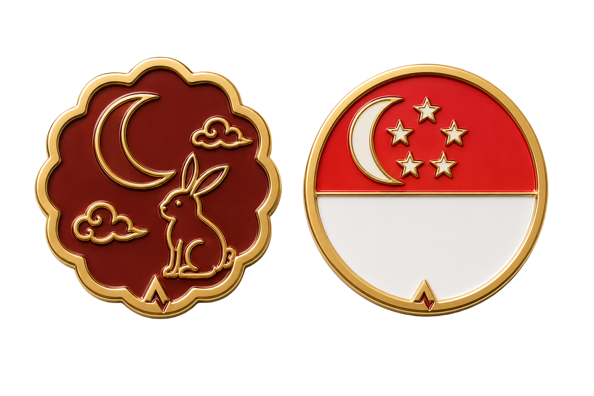

# Guild Enamel

Metal-and-enamel achievement badges—achievement badges, distance milestones, streak chips, and limited editions—generated with ChatGPT from a locked set of construction rules, so every badge you make looks like it belongs to the same family.

Part of the [Illustration Skills](../README.md) collection.

**📺 Watch the walkthrough:** [youtu.be/J_Cum67TpNA](https://youtu.be/J_Cum67TpNA)—full setup, start to finish.

  
  
  

## What you get

- **`SKILL.md`**—the brain. Locked construction rules (material, lighting, color logic) and the router that decides whether your request becomes an achievement badge, a distance milestone, a streak chip, or a limited edition.
- **`prompt-library.md`**—the fully spelled-out prompt text for each of those four formats. Backup reference wording, not the decision-maker.
- **`references/`**—the three example images above, used to anchor the visual style.

## Setup (about 10 minutes)

1. Create a ChatGPT Project. (The free plan works—Guild Enamel fits inside its limits.)
2. Open `SKILL.md` in any text editor—Notepad, TextEdit, VS Code, whatever you have. Find the **Brand tokens** section near the top and swap `PRIMARY_HEX`, `ACCENT_HEX_1`, and `ACCENT_HEX_2` for your own brand's colors.
3. Copy the whole file and paste it into the Project's **Instructions** field.
4. In the Project's settings, set **Memory** to "Project only." This keeps this brand's colors from leaking into your other ChatGPT projects, and vice versa.
5. Open the Project's **Sources** tab and upload `prompt-library.md` plus the three images in `references/`.
6. Get your own logo as a plain image file (PNG works well). Keep it handy—you won't upload it to Sources (see below), you'll attach it fresh each time.
7. Start a new chat inside the Project. Type what you want in a sentence—for example "50K ultra" or "10x streak"—and attach your logo file directly to that message before sending.

That's it. You now have a badge in your own brand colors.

## One thing worth knowing: always attach your logo to the message, don't upload it to Sources

ChatGPT doesn't reliably "see" images sitting in a Project's Sources tab as visual reference when it's actually generating something new—it knows the file exists, but it doesn't always use it. This is reliable enough for anything written as text (your brand colors hold up fine, since they're spelled out in `SKILL.md`), but not for anything that only exists as a picture—like an exact logo mark.

The fix: skip Sources for the logo entirely, and attach it directly to the message instead, every single time. That one habit is the difference between "always my logo" and "sometimes a logo ChatGPT made up."

## Re-skinning for a different brand

Because the whole system runs on three color values and a logo, making a version for a completely different brand takes minutes, not hours: swap the hex codes and the logo reference in `SKILL.md`, paste the updated file back into a Project's Instructions, and generate again. Same illustration system, completely different brand identity.

## License

The workflow, instructions, and prompt text here are [MIT-licensed](../LICENSE)—free to reuse, adapt, and republish.

The specific example images in `references/` and `assets/` are not covered by that license—see [IP-NOTICE.md](IP-NOTICE.md). Generate your own reference set for your own brand rather than republishing these.

---

Made by [Chip](https://madebychip.com) · part of [Illustration Skills](../README.md)
