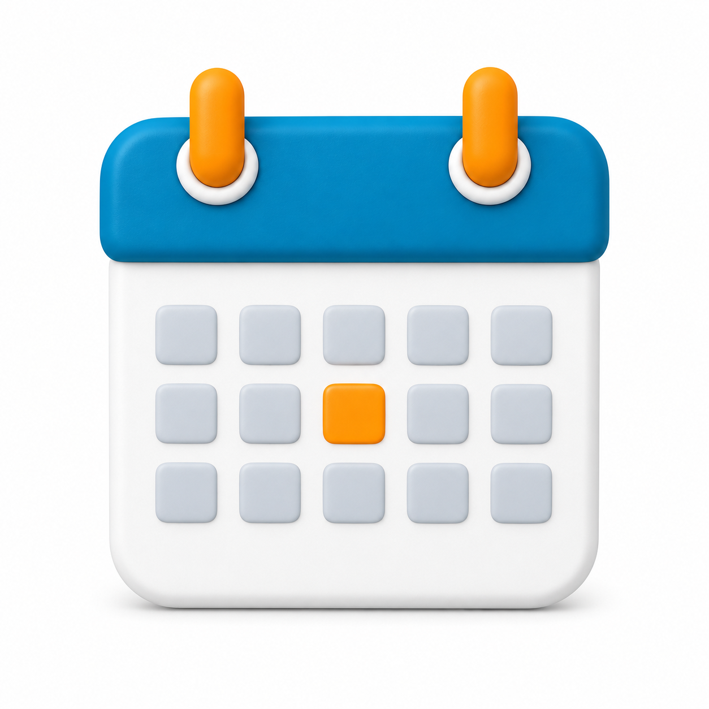
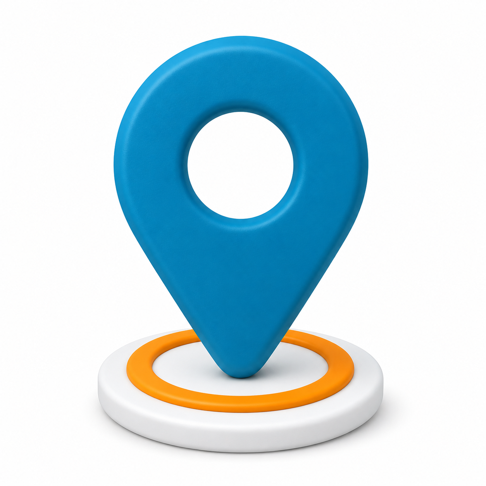
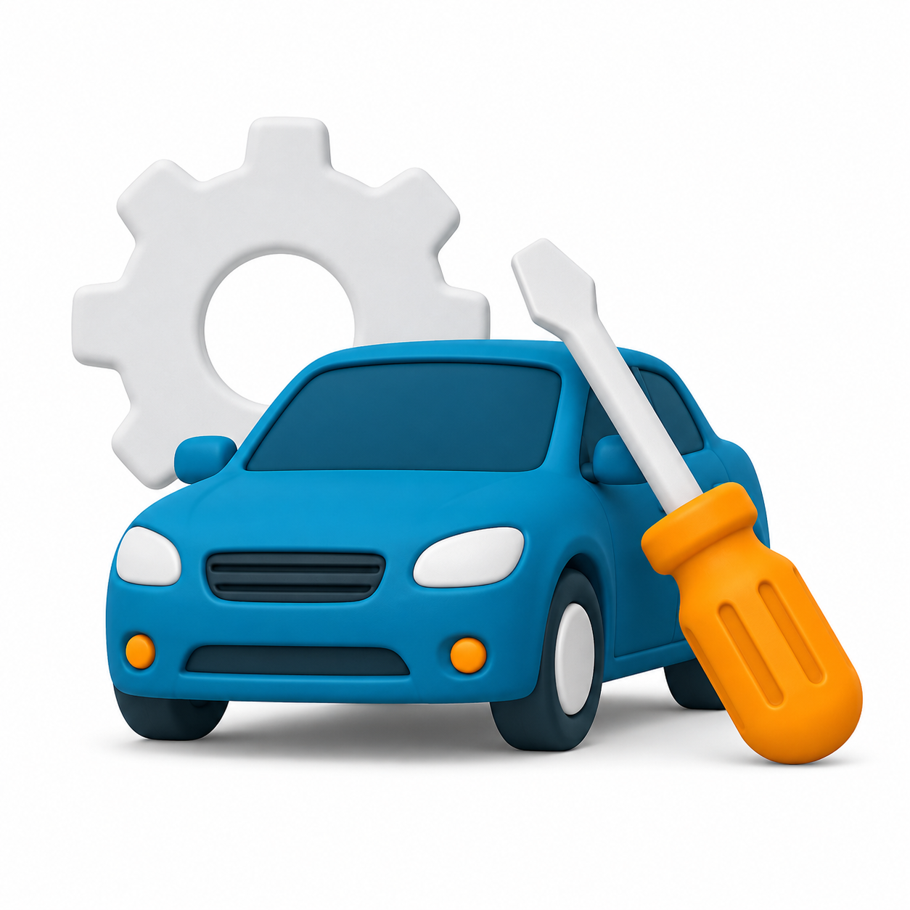

# Premium 3D Claymorphism

Soft-molded, premium 3D icons—calendars, location pins, phone calls, car repair, and anything else you can describe in a sentence—generated with ChatGPT from a locked set of construction rules, so every icon you make looks like it belongs to the same family.

Part of the [Illustration Skills](../README.md) collection.

  

  
  
  
  

## What you get

- **`SKILL.md`**—the brain. Locked construction rules (geometry, material, lighting, color logic) that turn a short request like "generate a calendar icon" into a polished icon in the established visual family, without you needing to describe the style each time.
- **`prompt-library.md`**—the fully spelled-out prompt text for the visual language. Backup reference wording, not the decision-maker.
- **`references/`**—the four example icons above, used to anchor the visual style.

## Setup (about 10 minutes)

1. Create a ChatGPT Project. (The free plan works.)
2. Open `SKILL.md` in any text editor—Notepad, TextEdit, VS Code, whatever you have. Find the **Default palette** section near the top and swap `PRIMARY` and `ACCENT` for your own brand's colors.
3. Copy the whole file and paste it into the Project's **Instructions** field.
4. In the Project's settings, set **Memory** to "Project only." This keeps this brand's colors from leaking into your other ChatGPT projects, and vice versa.
5. Open the Project's **Sources** tab and upload `prompt-library.md` plus the four images in `references/`.
6. Start a new chat inside the Project. Type what you want in a sentence—for example "generate a calendar icon" or "make a location pin, primary #7B3FF2 and accent #FFB000"—and send.

That's it. You now have an icon in your own brand colors.

## Keep requests short

The whole point of the skill is that you don't need to re-describe the style. "Generate a gift icon" is enough—the reference images and `SKILL.md` handle geometry, material, lighting, and composition automatically. Only add detail when you want to override something specific: a color, an aspect ratio, a supporting element to keep or drop.

When editing an icon you've already generated, say only what should change—"remove the coin," "make the accent red"—and everything else stays as it was.

## Re-skinning for a different brand

Because the whole system runs on two color values, making a version for a completely different brand takes minutes: swap `PRIMARY` and `ACCENT` in `SKILL.md`, paste the updated file back into a Project's Instructions, and generate again. Same icon system, completely different brand identity.

## License

The workflow, instructions, and prompt text here are [MIT-licensed](../LICENSE)—free to reuse, adapt, and republish.

The specific example images in `references/` are not covered by that license—see [IP-NOTICE.md](IP-NOTICE.md). Generate your own reference set for your own brand rather than republishing these.

---

Made by [Chip](https://madebychip.com) · part of [Illustration Skills](../README.md)
