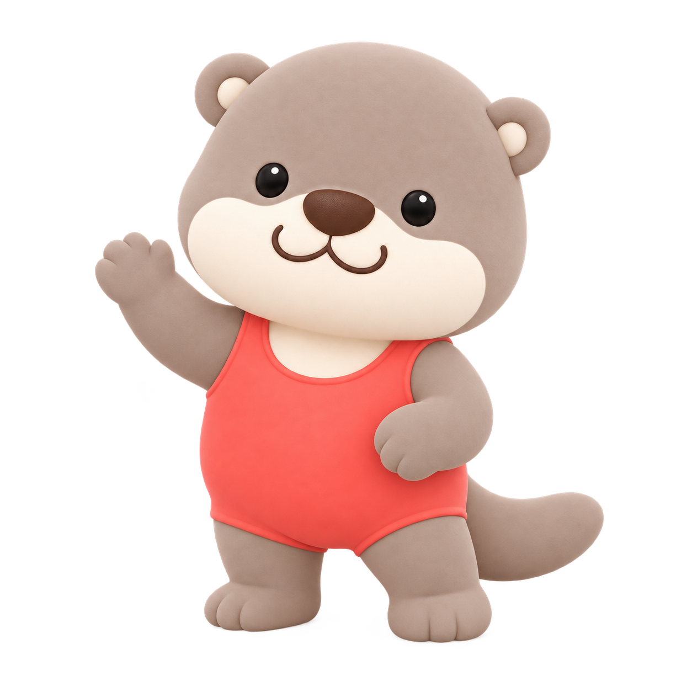
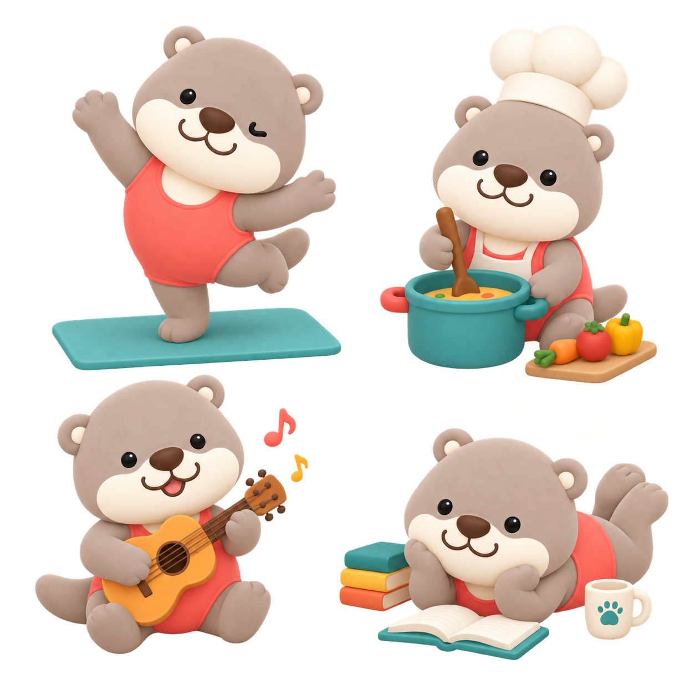
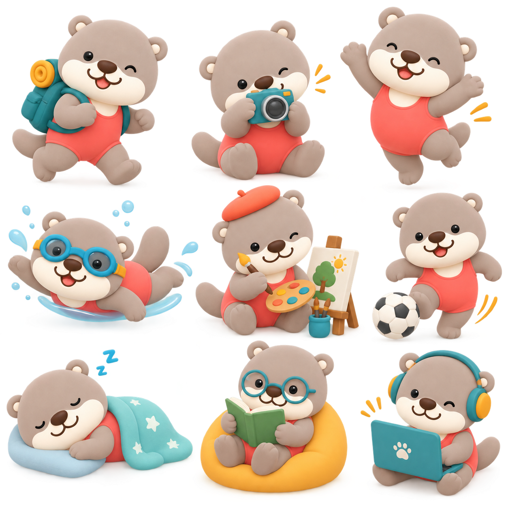
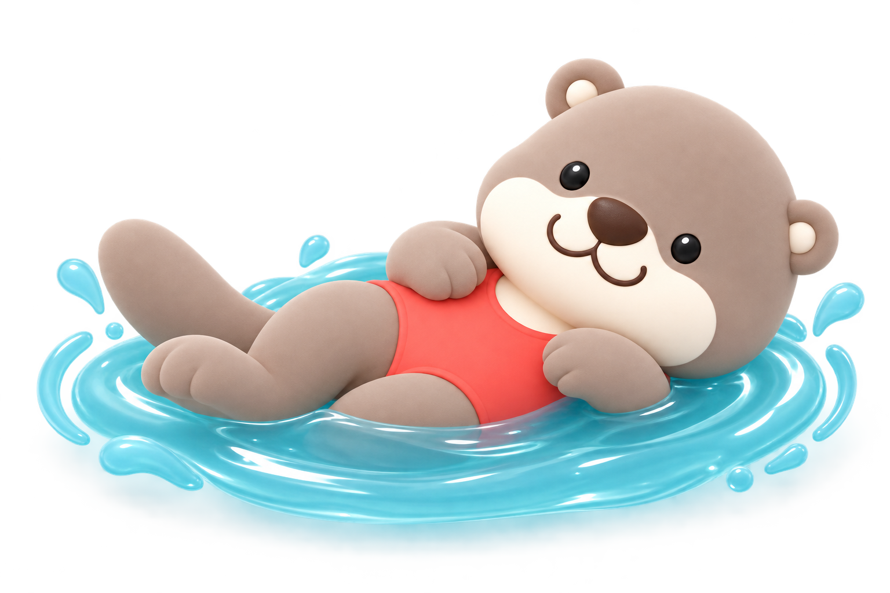

# Soft 3D Otter

Illustrations of one fixed character—the Hero Otter—doing whatever you describe: playing tennis, reading, cooking, sleeping in a different color outfit. Same character every time, generated with ChatGPT from a locked identity model.

Part of the [Illustration Skills](../README.md) collection.

  
  
  
  

## What you get

- **`SKILL.md`**—the brain. Locks the Hero Otter's identity (face, proportions, fur, tail, outfit) so only the activity, pose, expression, props, and clothing color are allowed to change.
- **`prompt-library.md`**—the fully spelled-out prompt text and reference-priority logic. Backup reference wording, not the decision-maker.
- **`references/`**—the four images above. `reference-1-hero-reference-otter.png` is the character itself; the other three anchor pose, expression, and rendering quality.

## Setup (about 10 minutes)

1. Create a ChatGPT Project. (The free plan works.)
2. Copy the whole contents of `SKILL.md` and paste it into the Project's **Instructions** field.
3. In the Project's settings, set **Memory** to "Project only." This keeps this character from leaking into your other ChatGPT projects, and vice versa.
4. Open the Project's **Sources** tab and upload `prompt-library.md` plus the four images in `references/`.
5. Get `reference-1-hero-reference-otter.png` handy on your device—you'll attach it fresh to every generation message (see below).
6. Start a new chat inside the Project. Attach `reference-1-hero-reference-otter.png` to your message, describe the activity in a sentence—for example "playing tennis" or "reading a book, blue outfit"—and send.

## Always attach the Hero reference to the message, every time

This is the one thing that matters most for this skill, more than for any other in this collection: ChatGPT doesn't reliably use images sitting in a Project's Sources tab as visual reference when it's actually generating something new. It knows the file exists, but it often doesn't look at it. Text instructions in `SKILL.md`—like the default clothing color—get followed regardless. Anything that depends on seeing pixels—the otter's face, fur, proportions, tail—will drift into a generic otter if the reference isn't attached directly.

The fix: attach `reference-1-hero-reference-otter.png` to the message every single time you generate, even though it's also sitting in Sources. That's the difference between "the same Hero Otter" and "a different otter that happens to wear red."

If a generation still doesn't match after attaching the reference, say so and describe what drifted (fur texture, face shape, proportions)—that's a sign the prompt needs tightening, not a Sources problem.

## Iterating on an existing illustration

Once you have a generation you like, keep editing it in the same chat rather than starting over—say only what should change ("make the outfit blue," "add a tennis racket," "make it sleep instead"), and the rest is preserved. Starting a fresh chat means re-attaching the Hero reference image again.

## License

The workflow, instructions, and prompt text here are [MIT-licensed](../LICENSE)—free to reuse, adapt, and republish.

The specific example images in `references/` are not covered by that license—see [IP-NOTICE.md](IP-NOTICE.md). Generate your own Hero character reference rather than republishing these.

---

Made by [Chip](https://madebychip.com) · part of [Illustration Skills](../README.md)
